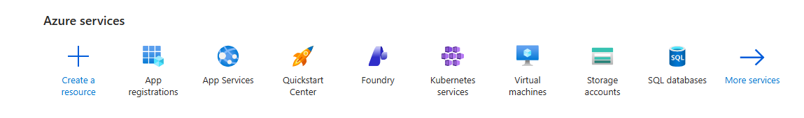
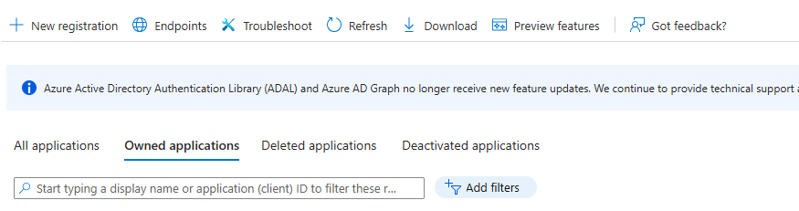
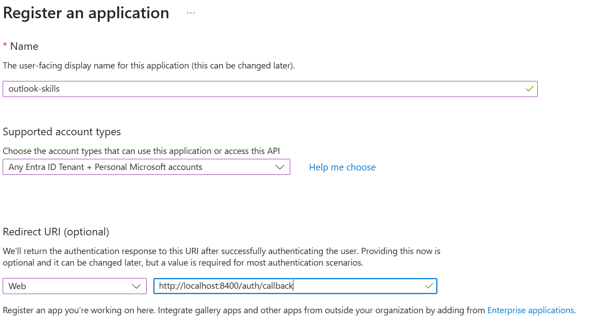
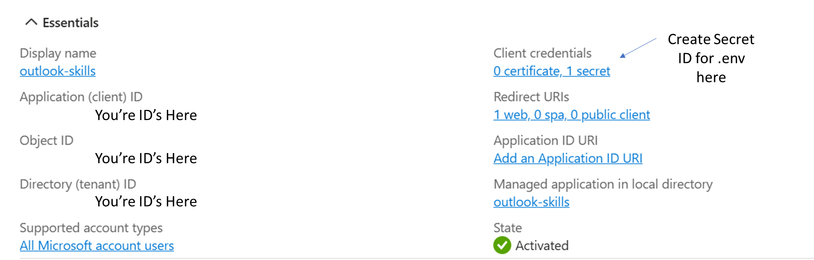
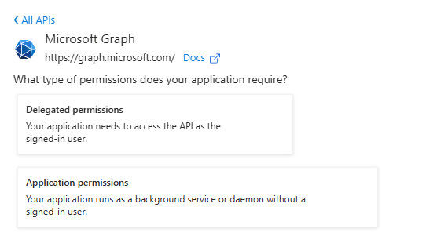
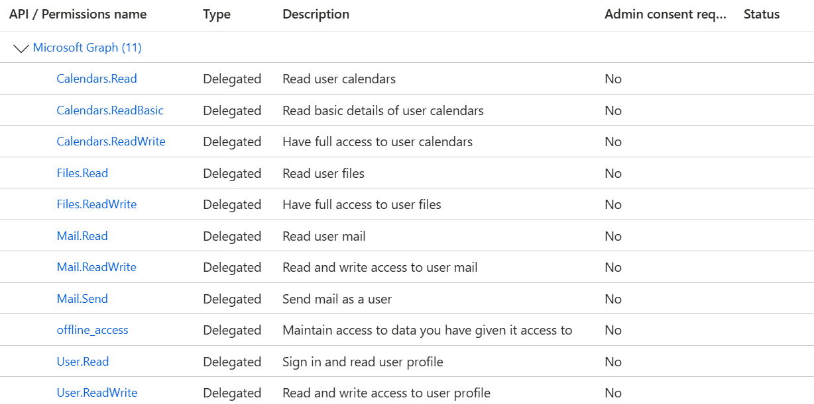

# Azure App Registration — Visual Setup Guide

This guide walks you through creating an Azure App Registration for the Outlook Skills plugin. You'll need this before you can authenticate and use the skills.

**Time required:** ~5 minutes

---

## Step 1: Navigate to App Registrations

Open the [Azure Portal](https://portal.azure.com/) and find **App registrations** in the Azure services section.



---

## Step 2: Create a New Registration

Click **+ New registration** in the toolbar.



---

## Step 3: Fill in Registration Details

Fill in the registration form with these settings:



| Field | Value |
|---|---|
| **Name** | Anything descriptive (e.g. `outlook-skills`) |
| **Supported account types** | *Accounts in any organizational directory and personal Microsoft accounts* |
| **Redirect URI** | Select **Web** and enter `http://localhost:8400/auth/callback` |

Click **Register**.

> **Important:** The redirect URI must exactly match `http://localhost:8400/auth/callback` — this is where the auth server listens for the OAuth callback.

---

## Step 4: Copy Your App Credentials

After registration, you'll see the app overview page. Copy the values you'll need for your `.env` file:



Copy these values — you'll need them in Step 8:

| Field | Where to find it | `.env` variable |
|---|---|---|
| **Application (client) ID** | Essentials section, left column | `OUTLOOK_CLIENT_ID` |
| **Directory (tenant) ID** | Essentials section, left column | `OUTLOOK_TENANT_ID` |

---

## Step 5: Create a Client Secret

From the app overview page, click **Client credentials** (shown in the screenshot above), or navigate to **Certificates & secrets** in the left sidebar.

1. Click **+ New client secret**
2. Add a description (e.g. "Outlook Skills") and select an expiration period
3. Click **Add**
4. **Copy the secret VALUE immediately** — you won't be able to see it again after leaving this page

> **Common mistake:** Azure shows both a **Secret ID** and a **Value** side by side. You need the **Value** (the longer string). Using the Secret ID instead causes error `AADSTS7000215: Invalid client secret`.

---

## Step 6: Add API Permissions

Navigate to **API permissions** in the left sidebar, then click **+ Add a permission**.

Select **Microsoft Graph**, then choose **Delegated permissions**.



---

## Step 7: Select Required Permissions

Search for and add each of the following delegated permissions:



| Permission | Purpose |
|---|---|
| `offline_access` | Silent token refresh (keeps you signed in) |
| `User.Read` | Read your profile |
| `Mail.Read` | Read emails |
| `Mail.ReadWrite` | Organise, move, delete emails |
| `Mail.Send` | Send emails |
| `Calendars.Read` | Read calendar events |
| `Calendars.ReadWrite` | Create and update events |
| `Contacts.Read` | Read contacts |

Click **Add permissions** after selecting each one.

> No admin consent is required — all permissions are delegated (user-level).
>
> The screenshot also shows `Files.Read` and `Files.ReadWrite` — these are optional and support future OneDrive integration.

---

## Step 8: Configure Your `.env` File

Back in your cloned repository, create the credentials file:

```bash
# macOS / Linux / WSL
cp outlook-skills/.env.example outlook-skills/.env

# Windows (PowerShell)
Copy-Item outlook-skills\.env.example outlook-skills\.env
```

Edit `outlook-skills/.env` and fill in the values you copied:

```bash
OUTLOOK_TENANT_ID=common
OUTLOOK_CLIENT_ID=your-application-client-id-from-step-4
OUTLOOK_CLIENT_SECRET=your-client-secret-value-from-step-5
```

Use `OUTLOOK_TENANT_ID=common` for personal Microsoft accounts. For a work or school account restricted to a single tenant, use your Directory (tenant) ID from Step 4 instead.

---

## Next Steps

You're ready to authenticate. Return to the [Quick Start](../README.md#quick-start) and continue from **Step 3: Authenticate**.

```bash
# macOS / Linux / WSL
bash outlook-skills/auth.sh

# Windows (PowerShell)
.\outlook-skills\auth.ps1
```

---

## Troubleshooting

**"Invalid client secret" (AADSTS7000215)**
You used the Secret ID instead of the secret Value in Step 5. Go back to **Certificates & secrets** and create a new secret — you cannot retrieve the old value.

**"Admin approval required"**
Check that the redirect URI in your `.env` matches `http://localhost:8400/auth/callback` exactly, and that it's registered under **Authentication > Redirect URIs** in the Azure portal.

**"Token file not found"**
Run the auth script first (see Next Steps above).

**API returns 403**
You may have added permissions after your last authentication. Re-authenticate to pick up the new scopes:
```bash
bash outlook-skills/auth.sh --reauth    # macOS/Linux
.\outlook-skills\auth.ps1 -Reauth      # Windows
```
